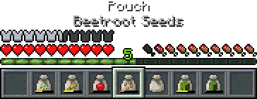
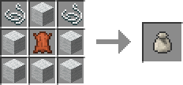

# PocketBags

.. is a Minecraft mod using [Fabric](https://fabricmc.net/) Loader and API that (currently) simply adds a Pouch item.

## Downloads

Available right here through [GitHub Releases](https://github.com/copygirl/).

##  Pouch

You can fill pouches with up to 9 stacks of any supported item, which includes most farmables (seeds and their resulting crops), saplings and flowers. Once a pouch has any item in it, it will automatically collect more of them as you pick them up.

They have the functionality to use the contained items in a 3x3 space centered on a block you click (such as planting up to 9 seeds), as well as feeding or breeding animals in a radius around the one you interact with.

### Crafting Recipe

- 6x Wool (any color)
- 2x String
- 1x Leather

### Modding

On the more technical side of things – in case you want to support PocketBags in your mod or modpack – pouches allow any item inside of them that is [tagged](https://minecraft.gamepedia.com/Tag) as `pocketbags:pouchable`, which automatically includes all `saplings`, `flowers` and `c:seeds`.
